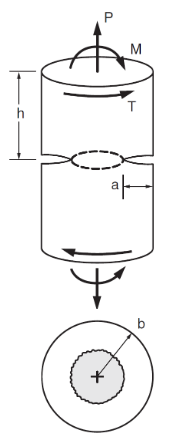
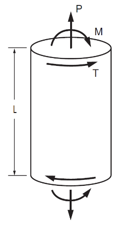

# Calculator for Mechanical Behaviour of Driveshafts

To use the automated shaft calculator tool, it must be opened in MATLAB, and run as a script. Once this happens, a series of prompts will appear indicating required data, alongside the desired units. A summary of the data, and units used can be found below:

### Required user inputs
- shaft radius (m)
- shaft length (m)
- snap ring depth (m)
- Yield Strengh, Tensile (MPa)
- Fracture Toughness, Mode I & Mode III $( MPa \sqrt m )$
- Safety Factors (Yielding, Fracture Mode I, Fracture Mode II)
- Torque (N/m)
- Axial Force (N)
- Bending Moment (Nm)
- Stress Analysis Type (Maximum Shear or Octahedral)

### Nomenclature
The below diagrams depict the nomenclature used for analysis:

    
    

Where the following variables represent the above user inputs:
- P = Axial Force
- M = Bending Moment
- T = Torque
- b = shaft radius
- a = snap ring depth
- L = shaft length

Once all required user inputs have been added, the MATLAB script will output two text files, one of which displays mechanical properties of an un-notched shaft, while the second displays fracture mechanics of a shaft with a snap ring groove. For troubleshooting purposes, the output text files also include the input parameters, so you can assure you inputted the correct values as a first step, if the outputs seem incorrect.
